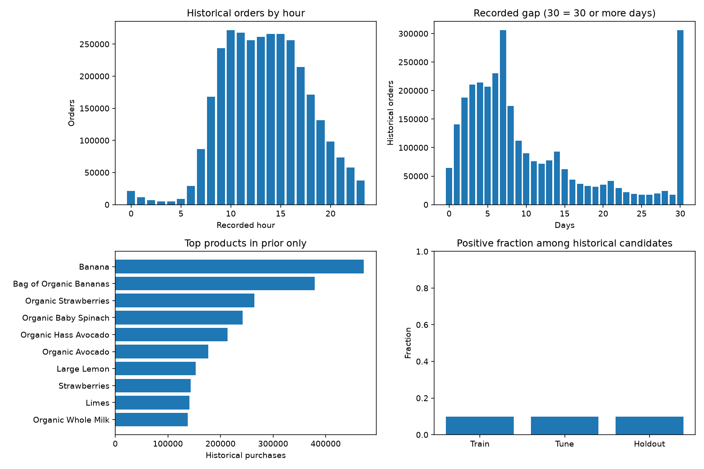
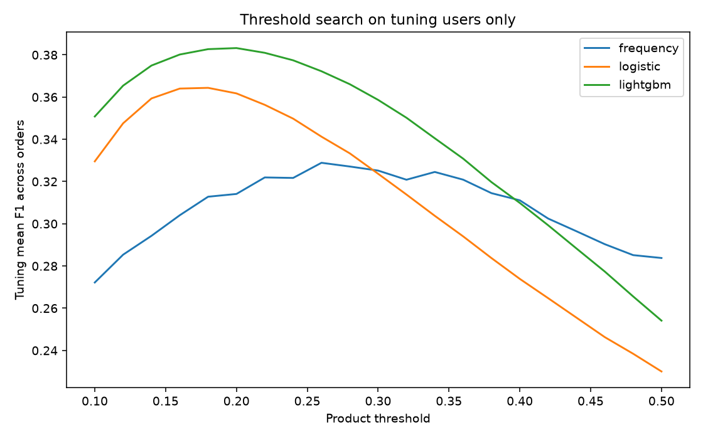

# Instacart Market Basket Analysis 分析レポート

実行日：2026-09-12。目的は、各ユーザーの次回注文に含まれる**再購入商品集合**の予測です。注文で初めて購入される商品は正解集合に含めません。

## 1. 結果と外部制限

LightGBMを閾値調整用ユーザーで選択し、設定固定後に26,242人の最終評価を行いました。mean F1 across ordersは**0.382596**。注文を単位とした1,000回のbootstrapによる95%区間は**0.379613～0.385649**です。この区間は固定モデル・今回のholdoutについての標本変動で、学習のやり直しや別分割の変動を含みません。

公式競技は現在[Market Basket Analysis](https://www.kaggle.com/competitions/basket-analysis)として表示され、主催者の要請で無効化されています。データタブには削除の説明とsample_submission.csvのみが残り、Late Submissionはdisabledでした。したがって**実提出0件、公式スコアなし**です。提出形式CSVの生成と、公式サーバーによる採点を区別します。

## 2. データ出所・独立性

ユーザー承認のもと、[psparksの第三者保存版Version 1](https://www.kaggle.com/datasets/psparks/instacart-market-basket-analysis)をKaggle配布APIから取得しました。ZIPは207,073,669 bytes、SHA-256は`c347cd7fa301c068ed391c7c77620f0e26e18f65d04cb907b6389c670db03038`。全入力ファイルのSHA-256と取得日時を`data_provenance.json`に記録しています。**元の公式配布物とのバイト一致は確認できていません。** ミラー側のライセンス表記だけで公式データの再配布権を保証できないため、元データはGitHubに含めません。

このタスク内に新しいPython仮想環境を作成しました。Titanic、House Prices、Store Sales、Credit Card Fraud、NLP Disaster Tweetsのデータ、環境、モデル、特徴量、分析成果物は利用していません。過去ログは取得方法・公開方法の確認に限って参照しました。既存のGitHub認証は使用します。

| テーブル | 行数 | 主なキー |
| --- | ---: | --- |
| orders | 3,421,083 | order_id、一意 |
| order_products__prior | 32,434,489 | order_id + product_id、一意 |
| order_products__train | 1,384,617 | order_id + product_id、一意 |
| products | 49,688 | product_id、一意 |
| aisles | 134 | aisle_id、一意 |
| departments | 21 | department_id、一意 |

## 3. 結合と最終注文の監査

`order_products → orders`はorder_idによるmany-to-one、`order_products → products`はproduct_idによるmany-to-oneです。商品マスタからaisles、departmentsへは、それぞれaisle_id、department_idでmany-to-one結合します。キーの非欠損・一意性、複合キー重複、外部キーの存在を全件検査しました。結合で履歴行を失っていないこと、商品マスタ結合後の行数が増減しないことも確認しています。

ordersのeval_setはpriorが3,214,874注文、trainが131,209注文、testが75,000注文。全206,209ユーザーに対してorder_numberが1から連続し、prior以外の最終注文がちょうど1つ存在し、ユーザー内の最大order_numberに一致します。prior明細のorder_idはprior注文にのみ属し、train明細はtrain最終注文にのみ属します。全prior・train注文に明細が存在します。

ユーザー×商品ごとに、prior再購入回数が購入回数−1であること、最初の購入がreordered=0であることを確認しました。train明細については、過去購入済みか否かとreorderedが完全一致します。既知の正解再購入商品は候補集合に全件含まれます。testの正解は未公開のため、testのラベル網羅率は評価していません。

## 4. 欠損値の扱い

入力の欠損はorders.days_since_prior_orderの206,209件のみで、各ユーザーの初回注文に厳密に一致しました。初回には前注文が存在しないため、平均や中央値による推定は行いません。

- 平均注文間隔は欠損を除いたpriorの2回目以降で計算します。各ユーザーは少なくとも3回のprior注文があるため算出可能です。
- 相対経過日の累積値を作るときだけ、初回を日数原点0とします。欠損を「直前から0日」と推定したわけではありません。
- 商品購入が1回だけなら再購入間隔は観測不能です。`mean_purchase_interval=0`とし、`purchase_count=1`を同時に保持して識別します。
- マスタに含まれる文字列`missing`は既存カテゴリとして保持し、他カテゴリへ置換しません。
- target_gapなど最終注文の公開メタデータに欠損がないこと、全特徴量が有限であることを検査しています。

## 5. EDAと妥当性

履歴の注文サイズは中央値8商品、平均10.09商品、99パーセンタイル35商品。ユーザーのprior注文数は中央値9、10パーセンタイル3、99パーセンタイル88です。豊富な履歴を持つユーザーに偏った検証にならないよう、商品行ではなくユーザー単位で分割しました。

履歴購入の再購入フラグ率58.97%は「既に購入された明細の内訳」であり、予測候補の陽性率ではありません。全過去購入商品を候補にした場合、学習候補の陽性率は**9.76%**です。約90.2%が負例になるため、accuracyだけを改善する全負例予測は採用しません。

履歴では記録時間10～15時の注文が多く、7日間隔が306,181件あります。30日は306,137件ですが、**30日以上が丸められた値**なので「毎月ちょうど30日」と解釈しません。曜日番号から実際の曜日名は推定しません。購入頻度上位にはBanana、Bag of Organic Bananasなどが並びますが、上位商品を全ユーザーに配る候補生成は行いません。

EDAの時間・間隔・人気商品はpriorのみを集計しています。全priorを記述対象にした表を、グローバルな商品特徴量や学習済み変換としてモデルに取り込んでいません。分割ごとの正例率は整合性記録です。最終評価の正例率を使った分割変更・閾値再調整は行いません。分布の類似は無リークの証明ではなく、別途キー・時点・分割監査で検証します。

## 6. 候補集合と生成時点

ユーザーuの候補集合は、そのユーザーの全prior注文に1回以上現れたproduct_idの集合です。候補の間引きや人気商品による補完はなく、全体で13,307,953組です。

予測時点は「最終注文の日時・前回からの経過日という公開メタデータが既知で、購入内容は未知」の時点に固定します。履歴の最大order_numberがtargetより小さいこと、history_ordersがtarget.order_number−1であることを全候補に対して検査します。実運用で日時も未知の段階を予測する場合は、この設定をそのまま適用できません。

| 特徴量群 | 定義・利用時点 |
| --- | --- |
| frequency | priorでの購入回数 / prior注文数 |
| frequency_since_first | prior購入回数 / 最初に購入してからの注文機会数 |
| orders_since_last, days_since_product | 最終購入からtargetまでの注文数・記録日数 |
| last3_frequency | 直近3prior注文に占める購入割合 |
| purchase_count, mean_cart_position | prior購入回数・priorの平均投入順位 |
| mean_purchase_interval | 最初と最後の購入の注文番号差 / 購入回数−1。単発は0 |
| history_orders, mean_basket_size, basket_size_std | prior注文数・注文サイズ平均・標準偏差 |
| unique_products, prior_reorder_rate | prior購入商品の種類数・prior明細再購入率 |
| mean_order_gap, last_basket_size | prior平均間隔・最後のprior注文サイズ |
| target_gap, target_dow, target_hour | 最終注文の公開メタデータ |
| aisle_id, department_id | 静的商品分類。LightGBMでカテゴリ扱い |

user_id、order_id、product_idは識別・結合・提出にのみ使用し、予測器へ投入しません。targetの明細・投入順位・reorderedは特徴量に含みません。ロジスティック回帰の標準化は学習候補だけでfitします。ユーザーをまたぐ商品集計・target encodingは使用しません。

別実装の`verify_features.py`はtrainラベルを読み込まず、100万行チャンクでpriorを走査します。各分割から2名、合計8名・561候補の18特徴量を元CSVから独立再計算し、最大絶対差7.63×10^-7で一致しました。この抽出検査と全件の構造監査を併用しています。

## 7. ユーザー分割・モデル比較

| 用途 | ユーザー数 | 候補数 |
| --- | ---: | ---: |
| 学習 | 78,725 | 5,089,927 |
| 閾値調整・モデル選択 | 26,242 | 1,694,038 |
| 最終評価 | 26,242 | 1,690,696 |
| 競技test | 75,000 | 4,833,292 |

最終train注文を持つ一意user_idのリストをseed20260912で60% / 40%、残りをseed20260913で半分に分けました。一意ユーザーを分割後にそのユーザーの全候補を割り当てるため、GroupShuffleSplitと同じユーザー隔離条件を満たします。4集合すべての組合せで交差が空です。分割表そのものは非公開領域に保存し、SHA-256を監査JSONに記録しました。

1. 購入頻度ベースライン：frequencyをスコアに使用。
2. ロジスティック回帰：18数値特徴、学習データのみのStandardScaler、平均化SGD、log_loss、L2 alpha=0.0001。全学習候補を使用し、上限30epoch、実際は8epoch。
3. LightGBM：18数値＋2カテゴリ、180木、学習率0.06、31葉、葉の最少サンプル150、L2=5、CPU6スレッド。木数・設定はholdoutを見る前に固定し、early stoppingは使っていません。

負例は捨てず、class_weightも付けず、確率的なスコアを学習しました。クラス重み付けで確率が変わることを避け、注文F1を目的とした閾値探索で不均衡へ対応しています。購入頻度とロジスティック係数は解釈しやすい比較対象です。相関する説明変数があるため係数やgainを因果効果と解釈しません。

## 8. 注文F1・None・閾値

[公式評価仕様](https://www.kaggle.com/c/basket-analysis/overview)に合わせ、注文ごとに正解集合Aと予測集合Pの`2|A∩P|/(|A|+|P|)`を求め、注文を等重みで平均します。商品行のmicro-F1や、全注文を混ぜたF1を主指標にしません。

正解再購入商品が0ならAは文字列`None`だけの集合です。予測が空ならPも`None`だけにします。両方空ならF1=1、片方だけ空なら0。`None`と商品1の併記に対し、正解が`None`だけならF1=2/3です。文字列の大文字小文字を区別し、空CSVセルや小文字`none`に置換しません。

閾値候補は商品スコア0.10～0.50の0.02刻み21通り。`p_none=∏(1−p_item)`という商品独立仮定のヒューリスティックに対し、None閾値0.05 / 0.10 / 0.20 / 0.35 / 0.50 / 1.10を探索します。1.10は商品のある注文へのNone追加を無効にする比較条件です。全3モデル×21×6＝**378通り**を調整用26,242注文だけで比較しました。

選択結果はLightGBM、商品閾値**0.20**、None追加閾値**0.05**。商品が一つも選ばれなければ常にNone、商品が選ばれてもp_noneが0.05以上ならNoneを併記します。None確率には独立性・校正誤差があり、真の空注文確率とは限りません。最適None閾値は探索範囲の下端なので、グローバルな最適性は主張しません。

`selection_locked.json`を保存してから最終評価ファイルを開きました。最終評価後は選択を変更していません。`test_metrics.py`は空集合、重複、大小文字、None併記に加え、100組×25注文の乱数例を別の集合実装と照合しています。

## 9. 最終評価と解釈

| モデル | 調整F1 | 最終評価F1 | 候補Average Precision | 候補log loss |
| --- | ---: | ---: | ---: | ---: |
| 購入頻度 | 0.328883 | 0.330950 | 0.322947 | 0.313680 |
| ロジスティック回帰 | 0.364377 | 0.361675 | 0.397118 | 0.254621 |
| LightGBM | 0.383214 | 0.382596 | 0.427702 | 0.246062 |

全Noneの注文F1は0.064858、前回の全購入商品を再度予測する比較は0.310789。LightGBMは後者を絶対値で約0.07181上回りました。APとlog lossは補助指標であり、モデル選択は注文F1で実施しました。選ばなかったモデルのholdoutスコアも透明性のため掲載していますが、再選択には使っていません。

| 真の再購入商品数 | 最終評価注文数 | 選択モデルF1 |
| --- | ---: | ---: |
| 0 | 1,702 | 0.444086 |
| 1～4 | 11,095 | 0.293440 |
| 5～9 | 7,720 | 0.412880 |
| 10以上 | 5,725 | 0.496264 |

小さい正解集合の注文では過剰予測の影響が大きく、1～4商品の群で性能が低いことが分かります。この切り口は事後診断であり、この結果から閾値を再調整していません。LightGBMのgain上位は直近3注文の購入割合、初回以降の頻度、最終購入からの注文数です。

## 10. メモリ効率と再現性

IDはint32、注文番号・投入順位はint16、二値フラグ・時間はint8、特徴量はfloat32、eval_setと商品分類はカテゴリ型を用いました。prior4列は約356.8MBで、全列int64の場合の約1,037.9MBから約65.6%削減しています。文字列マスタを3,243万行へ展開せず、まずユーザー×商品へ集約し、分割別Parquetへ書き出しました。途中の大きいフレームを解放しています。

準備処理は52.9秒、peak working set約3.53GBでした。学習・再学習の実測は`runtime_train.json`に別記します。今回の機器にはメモリ余裕があり、主集計は全priorを読み込みました。独立再検証は100万行チャンクです。主パイプライン全体が任意の低メモリ機器で動くストリーミング実装であるとは主張しません。低メモリ環境ではuser_idによるパーティション集計等が追加で必要です。

入力ハッシュ、固定依存バージョン、seed、モデル設定、分割ハッシュ、全探索結果、独立検証コードを添付しました。再実行手順はREADMEを参照。最終モデルは設定固定後に全131,209学習ユーザーで再学習します。提出CSVは全75,000test注文を1回ずつ含み、商品は各ユーザーの履歴候補だけ、重複tokenなし、空セルなしを検査します。

## 11. 限界・受入判定

- 公式データが削除され、第三者保存版との公式バイト一致は未確認です。構造監査と公開されていた規模の一致は、公式同一性の証明ではありません。
- 競技が無効化されているため、Kaggle実提出・公式採点は未達です。ローカルF1を公式スコアとして扱いません。
- 単一のユーザーholdoutです。時期・地域・ユーザー構成が変わる実運用への一般化は未実証です。絶対日付がないためユーザー間の厳密な暦時点分割はできません。
- 再購入予測に限定しており、新商品推薦・新規ユーザーのcold startには対応しません。
- 価格、在庫、販促、配送条件、世帯情報を使っていません。購買行動の因果説明にはなりません。
- 商品間の相関をNoneヒューリスティックで無視します。注文ごとの期待F1最適化や空注文専用モデルは未比較です。
- 0.02刻みの閾値と固定LightGBMのみの限定比較です。最終holdoutを見た追加探索は新しい検証設計を必要とします。
- 元データ・個別ラベル・モデルは公開対象外です。再現には取得元からデータを用意する必要があります。

詳細なPASS/FAILは`ACCEPTANCE.md`、外部状況は`kaggle_status.json`、公開先一致はローカルの`PUBLICATION_VERIFICATION.json`を参照してください。
